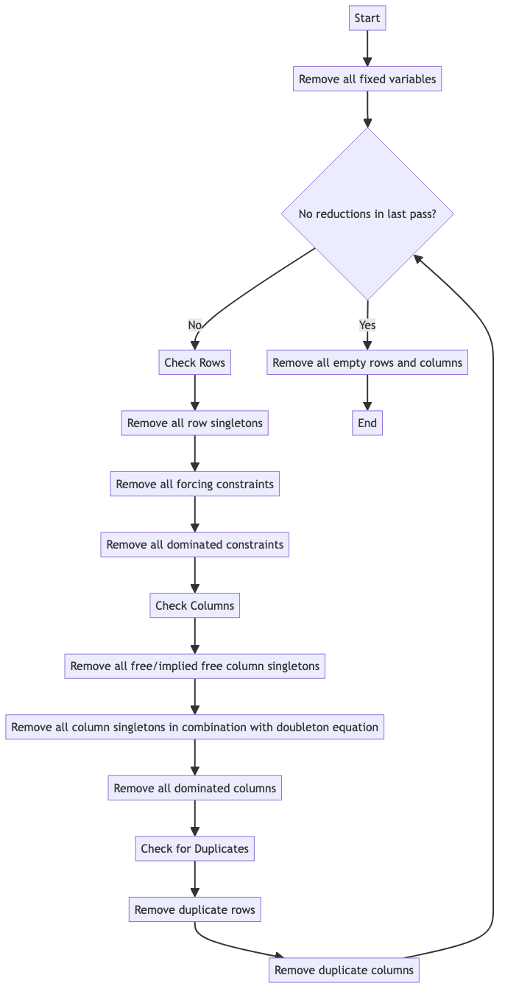

# Diagrams

This directory contains Mermaid diagrams and instructions for generating them.

## Files

- `Andersons-routine.mmd`: Mermaid diagram file for Anderson's 1995 routine.
- `README.md`: This documentation file.

## Generating Mermaid Diagrams

To generate diagrams from Mermaid `.mmd` files on your local machine, follow the steps below:

### 1. Install Mermaid CLI

Ensure you have Node.js installed on your machine. Then, install the Mermaid CLI globally:

```bash
npm install -g @mermaid-js/mermaid-cli
```

### 2. Create or Edit a Mermaid Diagram File

Create a .mmd file containing your Mermaid diagram syntax. For example:

```mmd
graph TD
    A[Start] --> B[Remove all fixed variables]
    B --> C{No reductions in last pass?}
    C --> |No| D[Check Rows]
    D --> E[Remove all row singletons]
    E --> F[Remove all forcing constraints]
    F --> G[Remove all dominated constraints]
    G --> H[Check Columns]
    H --> I[Remove all free/implied free column singletons]
    I --> J[Remove all column singletons in combination with doubleton equation]
    J --> K[Remove all dominated columns]
    K --> L[Check for Duplicates]
    L --> M[Remove duplicate rows]
    M --> N[Remove duplicate columns]
    N --> C
    C --> |Yes| O[Remove all empty rows and columns]
    O --> P[End]
```

### 3. Compile the Diagram

To generate an image from your .mmd file, use the mmdc command:
```bash
mmdc -i Andersons-routine.mmd -o Andersons-routine.png
```
or 
```bash
mmdc -i Andersons-routine.mmd -o Andersons-routine.svg
```
- -i: Specifies the input file (in this case, Andersons-routine.mmd).
- -o: Specifies the output file format (e.g., Andersons-routine.png).

This command will create a PNG or SVG image of the diagram in the same directory.

### 4. View the Diagram

Once the image is generated, you can view it using any image viewer. The generated file Andersons-routine.png will be located in the diagrams directory.


### 5. Update the Diagram

If you need to update the diagram, edit the .mmd file and rerun the mmdc command to regenerate the image.


### 6. Include the Diagram in Markdown

To include the generated diagram in this README.md or any other Markdown file, use the following syntax:
```markdown

```
<details>
    <summary>Example diagram.</summary>


<\details>

This will display the diagram when the Markdown file is viewed on supported platforms like GitHub.

## Example Workflow Recap

1. Create a .mmd file with your diagram code.
2. Use mmdc to compile the diagram into an image.
3. View or include the image in your documentation.

By following these steps, you can efficiently manage and document your Mermaid diagrams locally.

For more information on Mermaid syntax, visit [Mermaid documentation](https://mermaid.js.org).
